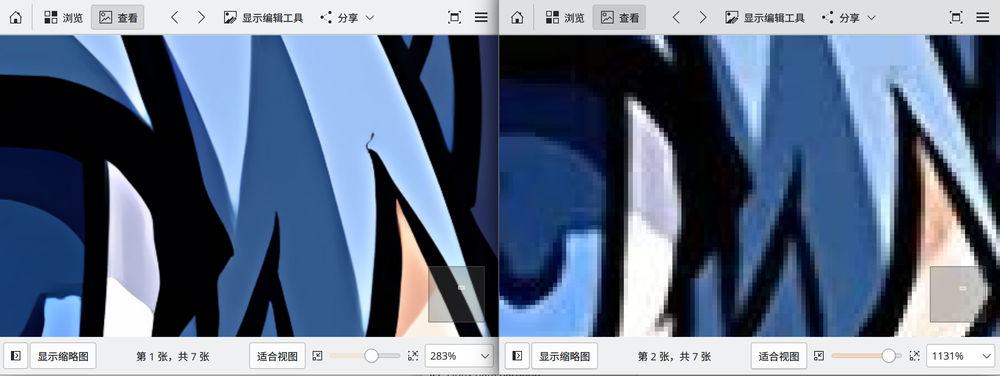
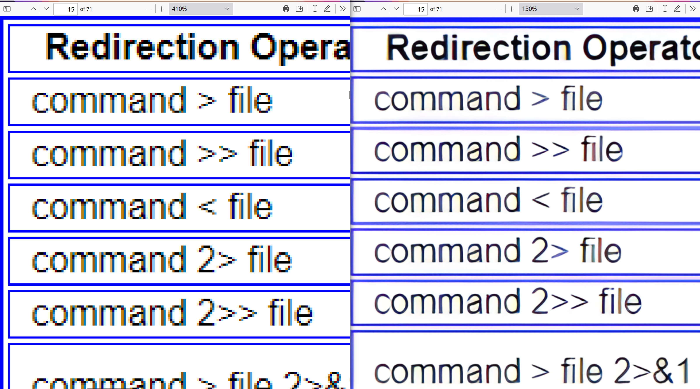
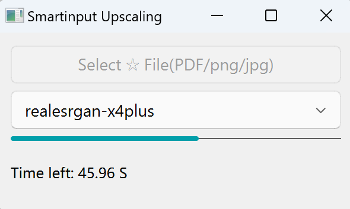
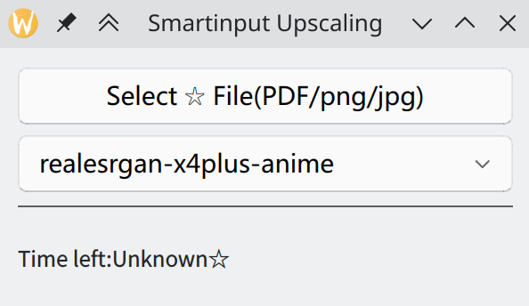
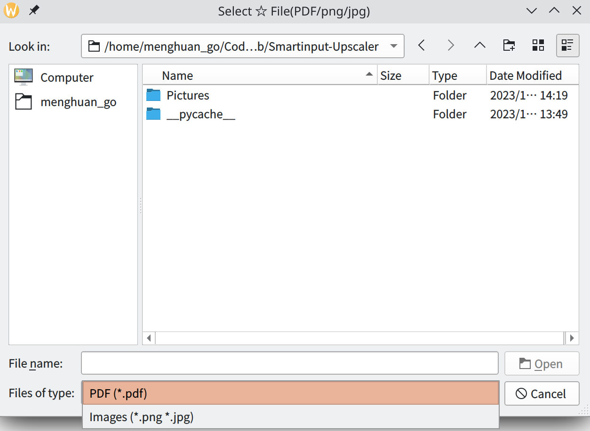
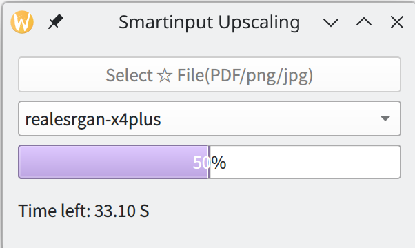

# Smartinput-Upscaler
([中文](README.md) | English)

Initially, it was because the school's ancestral ppt was too blurry, and I wanted to try to make it clearer. The project can run on both <b>Windows</b> and <b>Linux</b>.

The project is based on [Real-ESRGAN](https://github.com/xinntao/Real-ESRGAN) for convenient and fast super-resolution processing of various images/videos.

# TODO List

-   Refactor the interface using PyQt-Fluent-Widgets.
-   Add video support.
-   Implement batch processing for images.

# Usage
Currently, image and PDF inputs are supported. You can download the corresponding system version from Releases on the right side, which should be ready to use out of the box.

Note that if the source PDF is already clear enough, it may have a counterproductive effect! (i.e., even less clear)

In most cases, the conversion effect of PDF is as follows:

## Multi-platform support

## Model and File Selection

Since the backend uses [Real-ESRGAN-ncnn-vulkan](https://github.com/xinntao/Real-ESRGAN-ncnn-vulkan), it is able to use 3 models and supports Intel/AMD/Nvidia graphics card acceleration. The default model is the one suitable for general-purpose image processing.

## Progress bar with remaining time estimate

# Building from Source Code

## Install python environment
    conda create -n pdf_up python=3.11
    conda activate pdf_up
    pip install PyMuPDF
    pip install pyqt6
    pip install PyQt6-Fluent-Widgets -i https://pypi.org/simple/
    python GUI.py

## The model used comes from the Real-ESRGAN project. Please download the executable file from below and extract it in the root directory.
[Real-ESRGAN_README](https://github.com/xinntao/Real-ESRGAN/blob/master/README.md#portable-executable-files-ncnn)